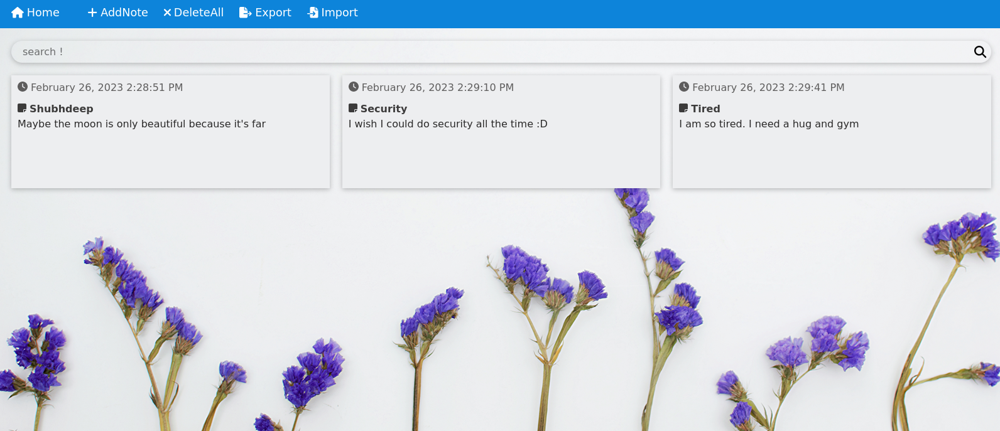

# 🔍 NotesArena

This is a React-based notes app that allows users to easily create, read, update, and delete notes. The app utilizes local storage to ensure that notes are saved and accessible even after the browser is closed. Additionally, the app supports the import and export of notes, making it easy for users to transfer their notes to other devices or applications
## 🚀 Demo

**Link** : https://shubhdeeprose.github.io/notesarena/

## 📝 Features

- **Create notes**: Users can create new notes by providing a title and a description.

- **Read notes**: Users can view all of their notes on a home page, and click on individual notes to view their content.

- **Update notes**: Users can edit the title or description text of existing notes, and the changes will be saved to local storage.

- **Delete notes**: Users can delete notes they no longer need, and the notes will be removed from local storage.

- **Import notes**: Users can import JSON files containing note data, and the notes will be added to their collection. Please note that it will override the existing notes so Please make sure to export your current notes before importing to avoid losing any data

- **Export notes**: Users can export their notes as a JSON file, which can be downloaded and saved for future use.

- **Responsive design**: The app is designed to be responsive, and can be used on a range of devices and screen sizes.

- **Routing**: React Router v6 is used to handle routing, making it easy for users to navigate between different pages of the app.
## 🧠 Lessons Learned

* React Router v6
* Local and Session Storage in Browsers
* FileReader object - Read uploaded / imported JSON files.
* JSON Blobs - Export JSON to a downloadable file
* Responsive Web Design
## 🧩 Tech Stack

![JS][js-shield]
![CSS][css-shield] 

[html-shield]: https://img.shields.io/badge/HTML5-E34F26?style=for-the-badge&logo=html5&logoColor=white
[css-shield]:https://img.shields.io/badge/CSS-239120?&style=for-the-badge&logo=css3&logoColor=white
[node-shield]:https://img.shields.io/badge/Node.js-43853D?style=for-the-badge&logo=node.js&logoColor=white
[js-shield]:https://img.shields.io/badge/React-20232A?style=for-the-badge&logo=react&logoColor=61DAFB
